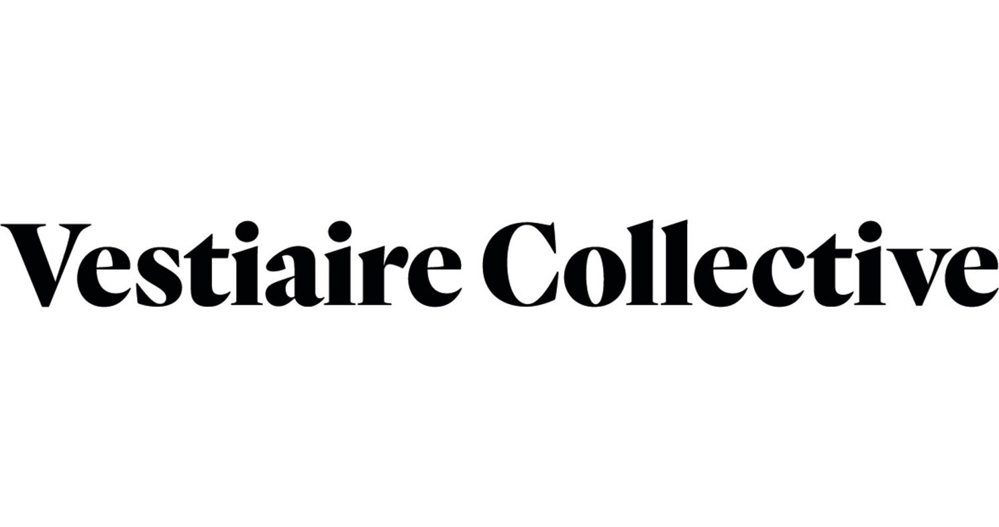

# Vestiaire Collective

## Context 

## Goals 🎯

## Machine Learning - `/predict` endpoint :computer:

## Deliverable 📬

To sum up, to complete this project, we produced:

- A **dashboard** in production (accessible via a web page for example)
- The **whole code** stored in a **Github repository**.
- A **MLFlow tracking server** on Heroku to track our machine learing model
- An **documented online API** on Heroku server `.